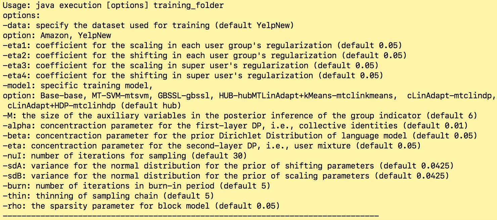
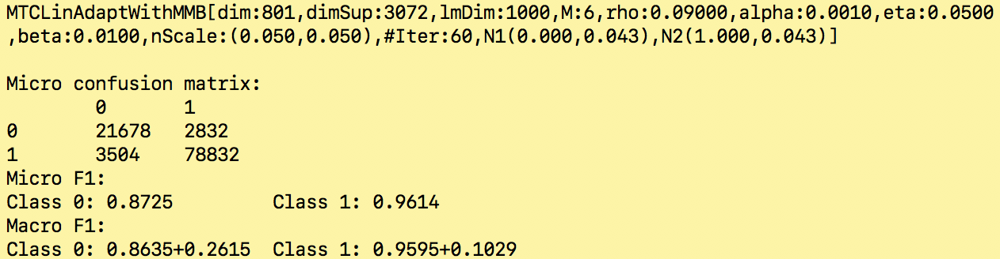

# HUB
This is the implementation for the paper titled ["When Sentiment Analysis Meets Social Network: A Holistic User Behavior Modeling in Opinionated Data"](https://www.cs.virginia.edu/~lg5bt/files/kdd2018.pdf). We provide all the source codes for the algorithm and related baselines.
## Quick Start (For Linux and Mac)
* Download the [HUB repo](https://github.com/Linda-sunshine/HUB.git) to your local machine.
* Download the [data]() to the directory that **./src** lies in.
* Compile the whole project with [complie file](https://github.com/Linda-sunshine/HUB/blob/master/compile).
```
./compile
```
* Run the algorithm with default setting with [run file](https://github.com/Linda-sunshine/HUB/blob/master/run).
```
./run
```
## Questions regarding running HUB and Baselines
### Q1: What's inside the ./data folder?
**./data** folder has all the data needed for the experiments reported in the paper, including both Amazon data (./data/CoLinAdapt/Amazon/) and Yelp data (./data/CoLinAdapt/YelpNew/). For example, **./data/CoLinAdapt/Amazon** contains the following files which are needed for running experiments with Amazon dataset:
```
CrossGroups_800.txt
AmazonFriends.txt
fv_lm_DF_1000.txt
GlobalWeights.txt
SelectedVocab.csv
./Users
```
* **CrossGroups_800.txt** contains the feature indexes for 800 feature groups.
* **fv_lm_DF_1000.txt** contains the 1000 textual features selected for training language models.
* **GlobalWeights.txt** contains the weights for sentiment features trained on a separate data, which serves as a base model.
* **SelectedVocab.csv** contains the 5000 sentiment features used for training sentiment models.
* **./Users** folder contains 9760 users.
* **AmazonFriends.txt** contains the friendship information. In each line, the first string is the user ID and the following strings are his/her friends' IDs.

### Q2: How to run the algorithm HUB with different parameters?
We use **-model** to select different algorithms and the default one is HUB.
The following table lists all the parameters for HUB:


### Q3: How to run baselines?
As reported in the paper, we have six baselines. We can use "-model" to select baselines, the corresponding parameters are specified in the above table. For example, I would like to run MT-SVM on Amazon dataset, then after the compiling, input the following command line:
```
./run -model mtsvm -data Amazon
```

### Q4: What does the output mean?
The final output of the algorithm is the sentiment classification performance of HUB, which is shown as follows. The first line is the information of the parameters used in the current run, which is the same as introduced in the first part. We also print out the confusion matrix, together with Micro F1 and Macro F1 for both classes. Micro F1 performance is calculated by aggregating all users’ reviews while Macro F1 is the average performance over all the users. Class 0 is negative class and Class 1 is positive class. Due to the randomness of initialization of model weights, the final sentiment performance may vary in different runs. More detail about the experimental setting can be found in our paper.


## Citing HUB
We encourage you to cite our work if you have referred it in your work. You can use the following BibTeX citation:
```
@inproceedings{gong2018sentiment,
  title={When Sentiment Analysis Meets Social Network: A Holistic User Behavior Modeling in Opinionated Data},
  author={Gong, Lin and Wang, Hongning},
  booktitle={Proceedings of the 24th ACM SIGKDD International Conference on Knowledge Discovery \& Data Mining},
  pages={1455--1464},
  year={2018},
  organization={ACM}
}
```
